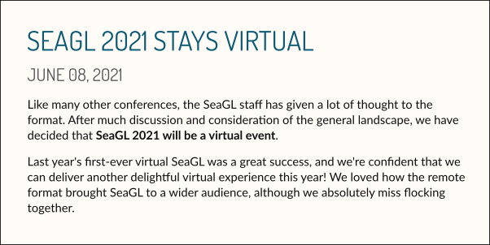
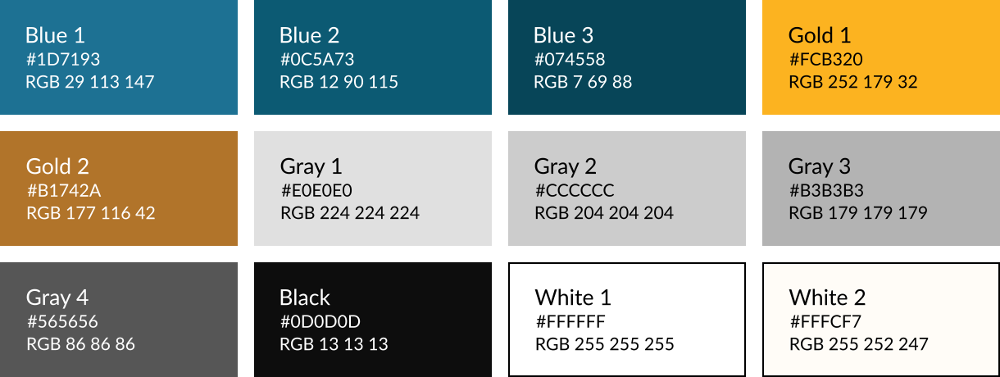
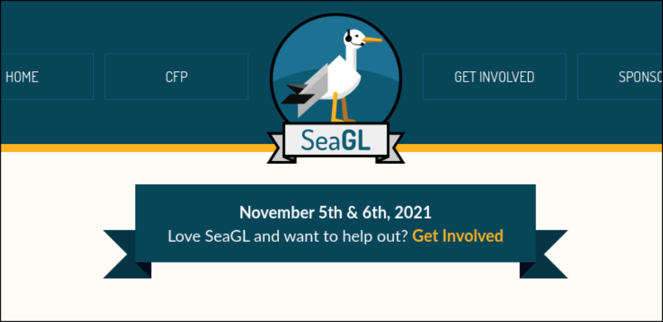

## SeaGL Style Guide

The goal of this guide is to group the common effort on the creation of design materials for the Seattle GNU/Linux Conference. It describes best practices for creating new materials and applying the visual identity of the event.

## Design

This section contains information about the visual elements of the conference, how to use them and best practices. All design assets are licensed under <a href="https://creativecommons.org/licenses/by-sa/4.0/">CC BY-SA</a>, unless otherwise specified.

### The Logo

Our logo is the most recognizable SeaGL symbol. Is composed of two elements: The low-poly seagull illustration with a circular two blue tone background and a gray ribbon underneath with the conference name.

As the logo is multicolored, we have limited background color options. White and the blue variations described on the color palette are the options for multiple context usage. Also, a special blue-white background with gold separation on the ribbon is used.

A minimum clear space around the logo is required, about 50% of the diameter on each side. Using with small size are not recommended, due to the logo complexity.

For the online events, there is a special version where the seagull is with a microphone. It follows the same restrictions as the classic version.

The logo images may be used without advance permission, subject to the following requirements:

- The use is only in connection with promoting the SeaGL conference.
- The use does not imply sponsorship or endorsement by the SeaGL conference.
- Where possible, the logo hyperlinks to https://seagl.org or an appropriate page on that site.
- The logo images are not altered, except to proportionally resize.

**Usage examples:**

- Blue Backgrounds

- Special "badge" background and other formats, with spacing

- White and White 2 backgrounds

## Font Styles

The SeaGL typography is one of the core elements that defines the conference design style. We use two fonts, <a href="https://fonts.google.com/specimen/Dosis">Dosis</a> and <a href="https://fonts.google.com/specimen/Lato">Lato</a>, according to the following:

- Dosis (Regular): Applied on headers / titles; capitals only.
- Lato: Other text elements, like text body.

Text alignment can vary by application, the important thing is to stay good in context.

**Usage Examples:**

- Blog post

- Social Media conference call:

- Print handbill:

## Color Palette

Any used colors should be taken either directly from the palette or be derived from the palette:

| Color                                                    | HEX       | RGB               | CMYK               |
|----------------------------------------------------------|-----------|-------------------|--------------------|
|  Blue 1  | `#1D7193` | `RGB 29 113 147`  | `CMYK 82 40 25 14` |
|  Blue 2  | `#0C5A73` | `RGB 12 90 115`   | `CMYK 87 46 34 25` |
|  Blue 3  | `#074558` | `RGB 7 69 88`     | `CMYK 89 47 40 47` |
|  Gold 1  | `#FCB320` | `RGB 252 179 32`  | `CMYK 2 34 89 0`   |
|  Gold 2  | `#B1742A` | `RGB 177 116 42`  | `CMYK 24 53 88 17` |
|  Gray 1  | `#E0E0E0` | `RGB 224 224 224` | `CMYK 0 0 0 16`    |
|  Gray 2  | `#CCCCCC` | `RGB 204 204 204` | `CMYK 0 0 0 23`    |
|  Gray 3  | `#B3B3B3` | `RGB 179 179 179` | `CMYK 0 0 0 39`    |
|  Gray 4  | `#565656` | `RGB 86 86 86`    | `CMYK 0 0 0 80`    |
|  White 1 | `#FFFFFF` | `RGB 255 255 255` | `CMYK 0 0 0 0`     |
|  White 2 | `#FFFCF7` | `RGB 255 252 247` | _digital only_     |
|  Black   | `#0D0D0D` | `RGB 13 13 13`    | `CMYK 0 0 0 100`   |

**Color palette overview:**

## Color Usage

The color usage must respect others elements rules, like the logo. Mainly, the blue and white variations are used for backgrounds.

The *White 2* color is used in digital material with focus on text, such as the website, for better reading.

Gold is applied to action links and to contrast with the blue / background, depending on the situation.

**Usage examples**

- Website Ribbon

- Profile Banner

## Design Assets

All design materials are available on the <a href="#">design folder</a> inside organization repository.

Specific materials and other quick reference files:

- <a href="#">Logo (png)</a>
- <a href="#">Logo (svg)</a>
- <a href="#">Logo with mic (png)</a>
- <a href="#">Logo with mic (svg)</a>
- <a href="#">Color Palette file</a>
- <a href="#">Templates</a>

## Contents:

- [Design](#Design)
	- [The Logo](#TheLogo)
	- [Font Styles](#FontStyles)
	- [Color Palette](#ColorPalette)
	- [Color Usage](#ColorUsage)
	- [Design Assets](#DesignAssets)

